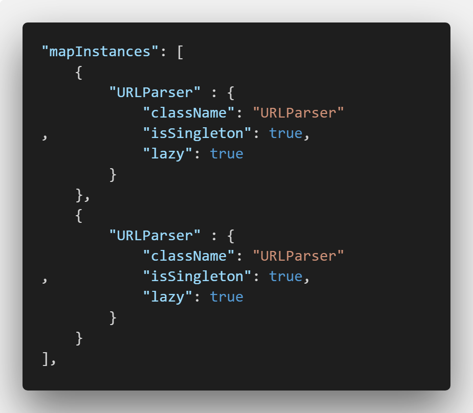
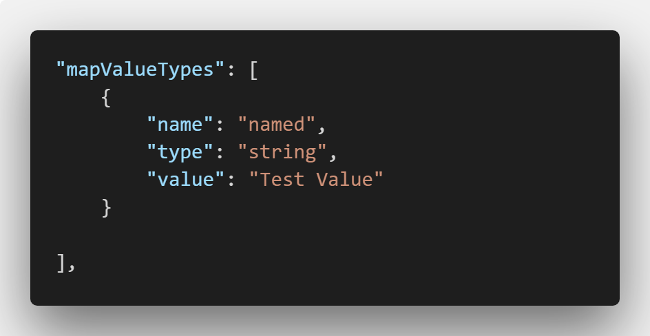
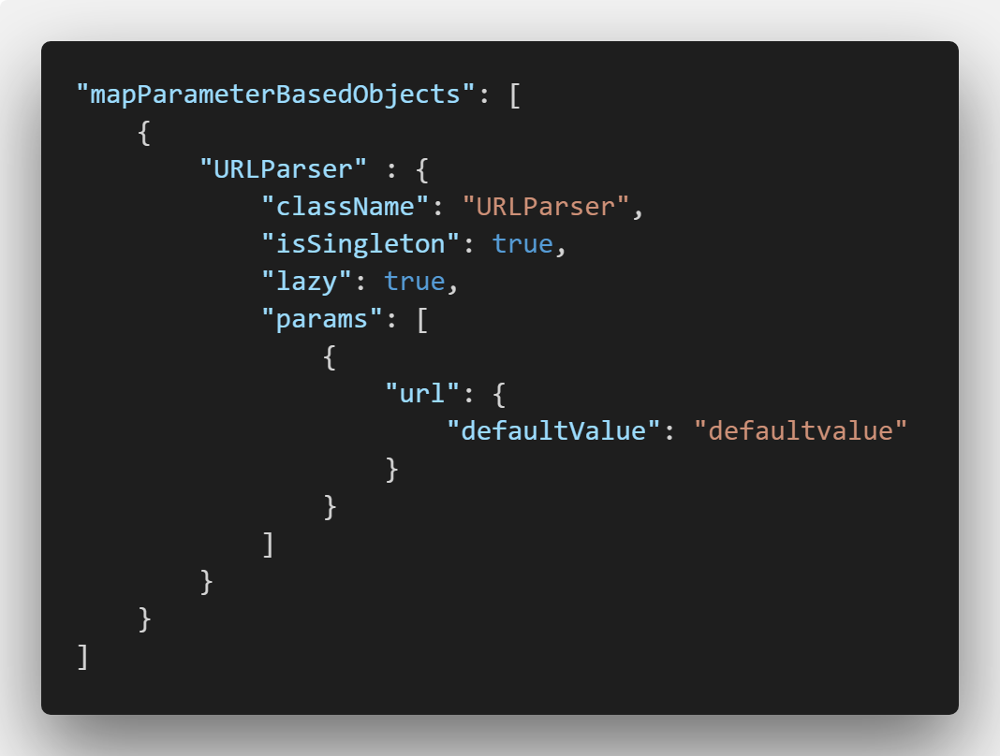

# PHPDI

## Welcome to the PHPDI project
----------------------------------

Hi, :smiley: :wave: 

This is a minimalistic PHP project with the aim to provide simple but powerfull solution to anyone, who thinks **Dipendency Injection** (DI) is something usefull.  

*PHPDI* is a DI container, allowing you to controll your dependencies throughout your whole project. Here I will not explain in details, what DI and the containers are. For more references, you can visit this site :point_right: [HERE](hhttps://en.wikipedia.org/wiki/Dependency_injectionttps://www.google.com)

 - [PHPDI](#phpdi)
    - [Welcome to the PHPDI project](#welcome-to-the-phpdi-project)
    - [So, now about the project](#so-now-about-the-project)
    - [**PHPDI_v1.1**](#phpdiv11)
        - [Config:](#config)
        - [Advantages](#advantages)
            - [No more endless `required_once`](#no-more-endless-requiredonce)
            - [Scope Check](#scope-check)
            - [Logger options](#logger-options)
            - [Exception Logger options](#exception-logger-options)
            - [Follow the best desgin principles](#follow-the-best-desgin-principles)
        - [How to use](#how-to-use)
    - [**PHPDI_v1.2**](#phpdiv12)
    - [Conclusion](#conclusion)

## So, now about the project 
------------------------------

The whole disign behind the realisation is *Convention over Configuration*. That, does not mean that you will not need to adjust some tweeks,but nothing special. 

**Currently there are two versions of the project:**  

*Beta* state means, that everithing tested so far works, but there might be some small bugs. 

*Alpha* state means, that it is still in phase of testing and might be unstable, but you can always give a try and report an issue, bug or missing feature. 

## **PHPDI_v1.1** 

### Config: 

| Config options | Description | Object type (Injection)  
| ------------- | ------------ |:-------------:| 
| className      | Name of the class to inject | Object, with parameterless constructor  | 
| isSingleton      | Creates singleton object | Object, with parameterless constructor      | 

| Config options | Description | Object type (Injection)  
| ------------- | ------------ |:-------------:| 
| name      | Name of the value  | Value type object  | 
| type      | Type of the object (string, int and so on) | Value type object      | 
| value      | Value, desired to be returned  | Value type object    |

| Config options | Description | Object type (Injection)  
| ------------- | ------------ |:-------------:| 
| className      | Name of the class to inject   |  Object, with  constructor with parameters  | 
| isSingleton      | Creates singleton object |  Object, with  constructor   with parameters    | 
| params | The params for constructor |   Object, with  constructor   with parameters   | 

In the params, the root node is the name of parameter in the constructor and in it the defaulValue. 

***IMPORTANT:*** **The config currently does not allow to use reference type parameters when calling an injection. To get a reference type object when calling a dependecy you should use the container in the constructor in the class of the dependcy and set its proprties with the injected objects there**

See the examples in the project. 

### Advantages 

#### No more endless `required_once`

There is an AutoLoader, which loads the classes automatically when needed. Just specify the path in the LoaderConfig.php once.   

#### Easy change between service (injection) providers

You can easily switch between different configured injection configurations for development, testing and production.

#### Scope Check 

Be sure that only allowed classes can create instance and use a dependency of object 

#### Logger options 

Option to log all injections - where and which examples are used. 

#### Exception Logger options 

Option to log some catched exceptions - where and which examples are used. 

#### Follow the best desgin principles 

Option to check whether all injections have and Interface, inherited by them. 

All these things, can be modified in the Config.php

### How to use 

1. Import Container in the file
2. Get instance of the container (static method) 
3. Call the requested method with the correct parameters. (To get reference type object pass the className with the "I" prefix -> IclassName).  
    3.1. Example for parameter for getInjectionWithParams method - `["params" => array(["name" => "url"])]);`  
    If "value" is not given, the default from the config is used. 

## **PHPDI_v1.2** 

In progress, 
 - ***main feature lazy instantiation*** 
 - ***easier use of different configs*** 

## Conclusion 

If you have read all the things until here, congratulations :clap: and thank you for your interest :thumbsup:

The license for this is open source and free to use. I will appriciate a star or a good word if you think it deserves it. 

You can raise issues and report problems or missing features. You can help with ideas and solutions too. 

For contact - ivangrigorov9 at gmail.com
